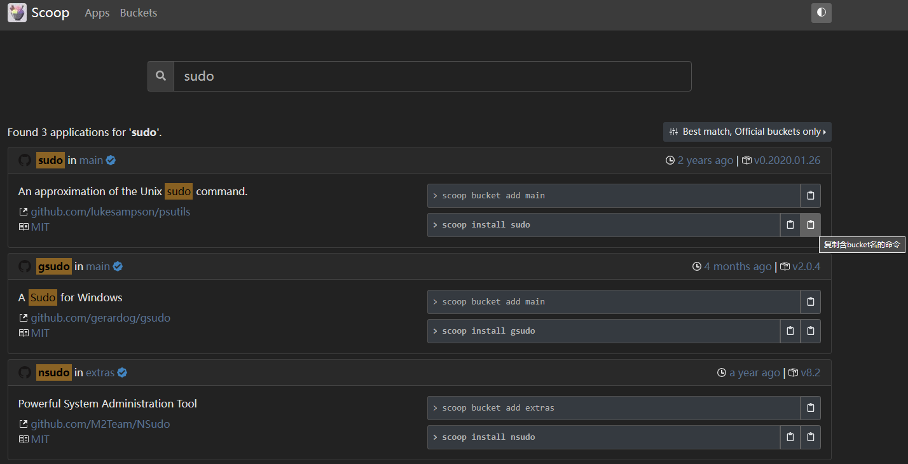

# readme

在[scoop.sh](scoop.sh)上搜索和复制命令来安装软件非常方便，唯一不足的是想要安装指定bucket的软件需要手动输入bucket名称，所以用这个脚本来增加一个按钮，让复制 `install` 命令时更方便。

效果如下：



* 左边按钮复制的内容：

```powershell
scoop install sudo
```

* 右边按钮复制的内容：

```powershell
scoop install main/sudo
```
